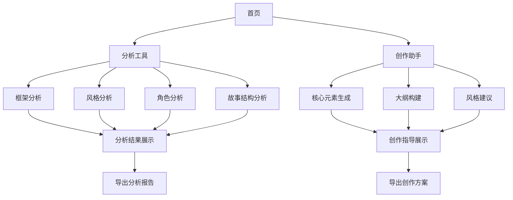

## 1. Product Overview
小说分析与创作辅助工具，帮助作家分析小说框架、风格、角色和故事结构，指导创作高质量小说。
- 主要功能包括小说框架分析、风格识别、角色分析、故事结构评估和创作指导
- 目标用户为小说作家、文学爱好者和写作教育者，帮助他们提升创作质量和效率

## 2. Core Features

### 2.1 User Roles
| Role | Registration Method | Core Permissions |
|------|---------------------|------------------|
| Normal User | Email registration | Access to all analysis and creation tools |

### 2.2 Feature Module
1. **首页**: 功能导航、工具介绍、快速开始
2. **分析工具**: 框架分析、风格分析、角色分析、故事结构分析
3. **创作助手**: 核心元素生成、大纲构建、风格建议

### 2.3 Page Details
| Page Name | Module Name | Feature description |
|-----------|-------------|---------------------|
| 首页 | 功能导航 | 提供各功能模块的快速入口，展示工具主要功能和价值 |
| 首页 | 工具介绍 | 详细说明工具的使用方法和适用场景 |
| 分析工具 | 框架分析 | 分析小说的整体结构，包括章节安排、情节发展等 |
| 分析工具 | 风格分析 | 识别小说的写作风格，包括语言特点、叙述方式等 |
| 分析工具 | 角色分析 | 评估角色塑造的深度和一致性，提供改进建议 |
| 分析工具 | 故事结构分析 | 分析故事的起承转合，评估情节连贯性和张力 |
| 创作助手 | 核心元素生成 | 根据用户输入生成小说核心元素，如主题、冲突等 |
| 创作助手 | 大纲构建 | 帮助用户构建小说大纲，包括章节安排和情节发展 |
| 创作助手 | 风格建议 | 根据用户需求提供写作风格建议和参考示例 |

## 3. Core Process
用户使用流程：
1. 用户访问首页，了解工具功能
2. 选择分析工具或创作助手模块
3. 输入小说内容或创作需求
4. 系统分析并生成结果
5. 用户根据分析结果进行创作或修改

## 4. User Interface Design
### 4.1 Design Style
- 主色调：深蓝色 (#1a365d) 和金色 (#d4af37)
- 次要色调：浅灰 (#f7fafc) 和深灰 (#2d3748)
- 按钮风格：圆角设计，悬停效果
- 字体：标题使用 Playfair Display，正文使用 Inter
- 字体大小：标题 24-32px，正文 16px，注释 14px
- 布局风格：卡片式设计，清晰的信息层次
- 图标风格：简约线条图标，搭配文学相关元素

### 4.2 Page Design Overview
| Page Name | Module Name | UI Elements |
|-----------|-------------|-------------|
| 首页 | 功能导航 | 卡片式导航栏，每个功能模块配有图标和简短描述，使用深蓝色背景和金色强调 |
| 首页 | 工具介绍 | 分栏布局，左侧文字介绍，右侧图示说明，使用浅灰色背景增强可读性 |
| 分析工具 | 分析输入区 | 文本输入框，支持文件上传，配有字数统计和格式提示 |
| 分析工具 | 结果展示区 | 卡片式布局，每个分析维度独立展示，使用图表可视化分析结果 |
| 创作助手 | 核心元素生成 | 表单输入区，支持主题、类型、风格等参数设置，结果以卡片形式展示 |
| 创作助手 | 大纲构建 | 树形结构展示，支持拖拽调整章节顺序，配有章节内容编辑功能 |

### 4.3 Responsiveness
- 桌面优先设计，支持响应式布局
- 移动端适配：调整布局为单列，优化触摸交互
- 平板设备：保持双列布局，调整元素大小

### 4.4 3D Scene Guidance
- 不适用，本产品为纯2D界面应用