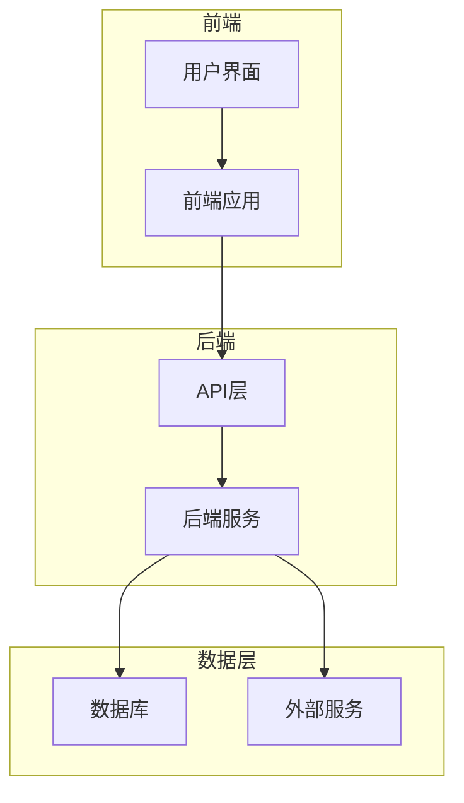
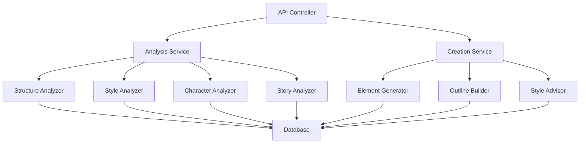
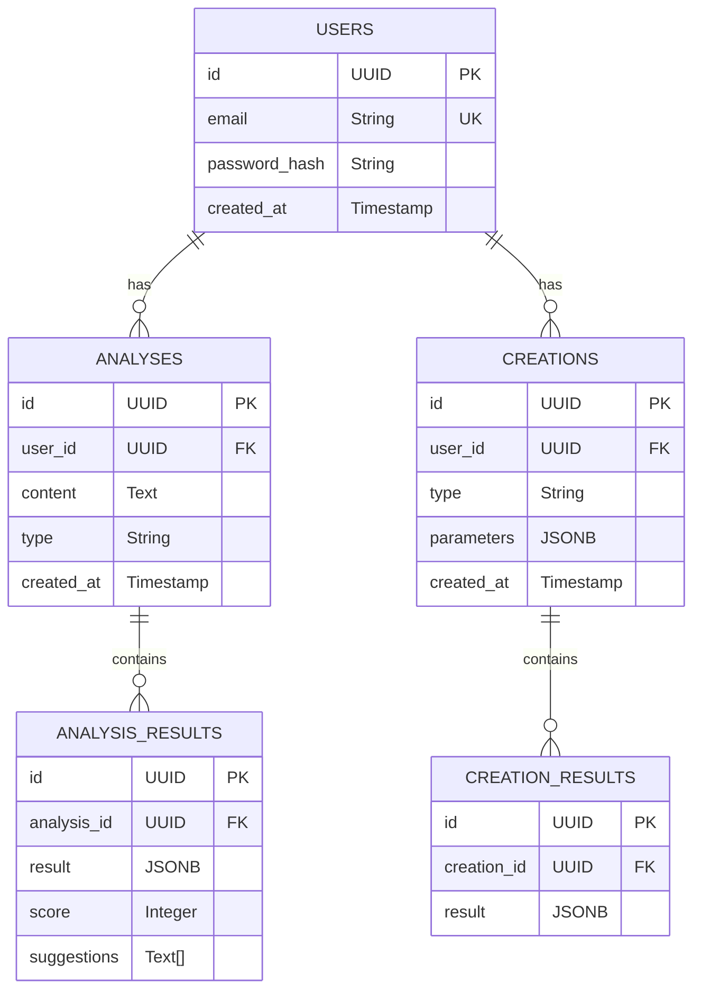

## 1. Architecture Design


## 2. Technology Description
- 前端: React@18 + TypeScript + Tailwind CSS + Vite
- 初始化工具: vite-init
- 后端: Express@4 + TypeScript
- 数据库: Supabase (PostgreSQL)
- 外部服务: 无

## 3. Route Definitions
| Route | Purpose |
|-------|---------|
| / | 首页，展示工具功能和导航 |
| /analyzer | 分析工具页面，包含框架、风格、角色和故事结构分析 |
| /creator | 创作助手页面，包含核心元素生成、大纲构建和风格建议 |
| /login | 用户登录页面 |
| /register | 用户注册页面 |

## 4. API Definitions
### 4.1 分析工具API

#### 4.1.1 框架分析
- **Endpoint**: POST /api/analyze/structure
- **Request Body**:
  ```typescript
  {
    content: string; // 小说内容
  }
  ```
- **Response**:
  ```typescript
  {
    success: boolean;
    data: {
      chapters: number; // 章节数量
      structureScore: number; // 结构评分
      chapterDistribution: number[]; // 章节长度分布
      suggestions: string[]; // 改进建议
    };
  }
  ```

#### 4.1.2 风格分析
- **Endpoint**: POST /api/analyze/style
- **Request Body**:
  ```typescript
  {
    content: string; // 小说内容
  }
  ```
- **Response**:
  ```typescript
  {
    success: boolean;
    data: {
      styleType: string; // 风格类型
      languageFeatures: string[]; // 语言特点
      tone: string; // 语调
      pace: string; // 节奏
      suggestions: string[]; // 改进建议
    };
  }
  ```

#### 4.1.3 角色分析
- **Endpoint**: POST /api/analyze/characters
- **Request Body**:
  ```typescript
  {
    content: string; // 小说内容
  }
  ```
- **Response**:
  ```typescript
  {
    success: boolean;
    data: {
      characters: {
        name: string; // 角色名称
        depth: number; // 角色深度评分
        consistency: number; // 角色一致性评分
        arcs: string[]; // 角色弧光
      }[];
      suggestions: string[]; // 改进建议
    };
  }
  ```

#### 4.1.4 故事结构分析
- **Endpoint**: POST /api/analyze/story
- **Request Body**:
  ```typescript
  {
    content: string; // 小说内容
  }
  ```
- **Response**:
  ```typescript
  {
    success: boolean;
    data: {
      storyStructure: string; // 故事结构类型
      tensionCurve: number[]; // 张力曲线
      plotHoles: string[]; // 情节漏洞
      suggestions: string[]; // 改进建议
    };
  }
  ```

### 4.2 创作助手API

#### 4.2.1 核心元素生成
- **Endpoint**: POST /api/create/elements
- **Request Body**:
  ```typescript
  {
    genre: string; // 小说类型
    theme: string; // 主题
    style: string; // 风格
  }
  ```
- **Response**:
  ```typescript
  {
    success: boolean;
    data: {
      elements: {
        theme: string; // 核心主题
        conflict: string; // 主要冲突
        setting: string; // 故事背景
        protagonist: string; // 主角设定
        antagonist: string; // 反派设定
      };
    };
  }
  ```

#### 4.2.2 大纲构建
- **Endpoint**: POST /api/create/outline
- **Request Body**:
  ```typescript
  {
    elements: {
      theme: string;
      conflict: string;
      setting: string;
      protagonist: string;
      antagonist: string;
    };
  }
  ```
- **Response**:
  ```typescript
  {
    success: boolean;
    data: {
      outline: {
        chapters: {
          title: string; // 章节标题
          summary: string; // 章节摘要
          keyEvents: string[]; // 关键事件
        }[];
      };
    };
  }
  ```

#### 4.2.3 风格建议
- **Endpoint**: POST /api/create/style
- **Request Body**:
  ```typescript
  {
    genre: string; // 小说类型
    style: string; // 目标风格
  }
  ```
- **Response**:
  ```typescript
  {
    success: boolean;
    data: {
      styleGuide: {
        language: string; // 语言特点
        tone: string; // 语调建议
        pace: string; // 节奏建议
        examples: string[]; // 参考示例
      };
    };
  }
  ```

## 5. Server Architecture Diagram


## 6. Data Model
### 6.1 Data Model Definition


### 6.2 Data Definition Language
```sql
-- 创建用户表
CREATE TABLE users (
    id UUID PRIMARY KEY DEFAULT gen_random_uuid(),
    email VARCHAR(255) UNIQUE NOT NULL,
    password_hash VARCHAR(255) NOT NULL,
    created_at TIMESTAMP DEFAULT NOW()
);

-- 创建分析表
CREATE TABLE analyses (
    id UUID PRIMARY KEY DEFAULT gen_random_uuid(),
    user_id UUID REFERENCES users(id),
    content TEXT NOT NULL,
    type VARCHAR(50) NOT NULL,
    created_at TIMESTAMP DEFAULT NOW()
);

-- 创建分析结果表
CREATE TABLE analysis_results (
    id UUID PRIMARY KEY DEFAULT gen_random_uuid(),
    analysis_id UUID REFERENCES analyses(id),
    result JSONB NOT NULL,
    score INTEGER,
    suggestions TEXT[]
);

-- 创建创作表
CREATE TABLE creations (
    id UUID PRIMARY KEY DEFAULT gen_random_uuid(),
    user_id UUID REFERENCES users(id),
    type VARCHAR(50) NOT NULL,
    parameters JSONB NOT NULL,
    created_at TIMESTAMP DEFAULT NOW()
);

-- 创建创作结果表
CREATE TABLE creation_results (
    id UUID PRIMARY KEY DEFAULT gen_random_uuid(),
    creation_id UUID REFERENCES creations(id),
    result JSONB NOT NULL
);

-- 为匿名角色授予读取权限
GRANT SELECT ON users, analyses, analysis_results, creations, creation_results TO anon;

-- 为认证角色授予所有权限
GRANT ALL PRIVILEGES ON users, analyses, analysis_results, creations, creation_results TO authenticated;
```